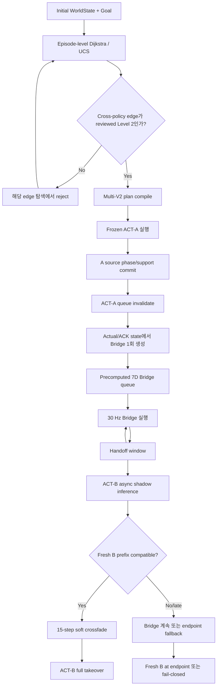
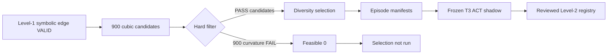

# A0509 Multi-V2 Bridge 구성과 T7→T3 direct edge 탈락·우회 실행 분석

작성일: 2026-08-30  
분석 대상 repository: `/home/rvlab/Dosan-MetaQuest-teleoperation-project`  
분석 대상 실제 run: `/home/rvlab/a0509_web_runs/20260830_011058_147808_460f73e5a14d`  
대상 목표: `drawer_top`의 blue block을 `floor`로 이동  
분석 방식: 현재 source code, semantic artifact, 900-pair candidate library, Level-2 registry, 실제 Multi-V2 trace 대조  

> 이 문서는 현재 working tree와 저장된 산출물을 source of truth로 사용한다. 아래의 곡률
> 통계는 정확히 `T7.acquire_from_drawer_top → T3.deliver_to_floor` edge에 대한 값이다.
> 과거 다른 T2/T3 smoke subset에서 얻은 곡률 통계와 혼용하면 안 된다.

---

## 1. 핵심 결론

이번에 사용자가 기대한 가장 짧은 semantic program은 다음이었다.

```text
T7.acquire_from_drawer_top
→ Bridge
→ T3.deliver_to_floor
```

이 경로는 symbolic Level 1에서는 유효하며 비용도 `2.25`로 가장 짧다. 그러나 현재
reviewed Level-2 실행 모드에서는 다음 direct cross-policy edge가 registry에 없다.

```text
T7.acquire_from_drawer_top
→ T3.deliver_to_floor
```

이 edge는 단순히 등록을 빼먹은 것이 아니다. 실제 T7 source support 30개와 T3
successor support 30개를 조합한 `30 × 30 = 900`개 Bridge 후보를 검사했지만,
900개가 모두 `curvature_limit` hard filter에서 탈락했다.

그 결과 파이프라인은 다음 단계로 진행할 수 없었다.

```text
900 candidates
→ hard-filter PASS 0
→ diversity selection 미실행
→ episode manifest 0
→ ACT-B shadow 0
→ reviewed Level-2 registry 미등록
```

Level-2 전용 Dijkstra는 미등록 edge를 탐색 중 사용할 수 없으므로, 다음 검증된 우회
program을 선택했다.

```text
T7.acquire_from_drawer_top
→ T7.deliver_to_black_table
→ T3.acquire_from_black_table
→ T3.deliver_to_floor

symbolic cost = 4.25
policy sequence = T7 → T3
```

따라서 실제 동작이 다음처럼 보인 것은 현재 planner와 registry 계약상 일관된 결과다.

```text
drawer top에서 집음
→ black table에 내려놓음
→ T3가 다시 집음
→ floor에 내려놓음
```

중요한 해석은 다음과 같다.

- direct task의 semantic 의미가 틀린 것은 아니다.
- T7과 T3가 원리적으로 절대 연결될 수 없다는 증거도 아니다.
- 현재 선택한 exact boundary와 4초 cubic Bezier, 현재 hard threshold의 조합에서
  feasible Bridge를 만들지 못했다는 뜻이다.
- 현재 direct edge의 최우선 문제는 Bridge 시작 경계가 `T7 S1의 파지 완료점 C1`에
  붙어 있어 endpoint 속도가 작고, 긴 chord에 비해 tangent handle이 지나치게 짧다는 점이다.

---

## 2. Level 1, Level 2, 실제 실행의 관계

### 2.1 Level 1: symbolic validity

Level 1은 robot trajectory를 보지 않고 `WorldState` precondition/effect와 policy
forward cursor만 검사한다.

이번 direct program의 state 변화는 다음과 같다.

```text
START
  blue_block_location = drawer_top
  holding = none
  gripper = open
  contact_mode = free_space

T7.acquire_from_drawer_top
  blue_block_location = held
  holding = blue_block
  gripper = closed
  contact_mode = free_transport

T3.deliver_to_floor
  blue_block_location = floor
  holding = none
  gripper = open
  contact_mode = free_space

GOAL SATISFIED
```

현재 cost는 다음처럼 단순하다.

```text
operator base cost                = 1.0 each
cross-policy switch penalty       = 0.25
same-policy continuation penalty  = 0.0
transition geometric cost         = 0.0
```

따라서 direct Level-1 비용은 다음과 같다.

```text
T7.acquire       1.00
T7 → T3 switch   0.25
T3.deliver       1.00
---------------------
total            2.25
```

### 2.2 Level 2: reviewed runtime edge만 허용

현재 실제 웹 실행은 `level2_only=true`였다. Level-2 UCS admission 규칙은 다음과 같다.

```text
첫 operator                         허용
같은 policy의 forward continuation  허용, Bridge 불필요
서로 다른 policy 간 transition      exact pair가 Level-2 registry에 있어야 허용
```

Registry edge 하나는 최소 다음 두 증거 파일을 가진다.

```text
exact handoff episode manifest
command-free frozen ACT successor shadow report
```

따라서 symbolic하게 맞더라도 registry에 없는 cross-policy edge는
`level2_edge_unavailable`로 탐색 중 거부된다.

### 2.3 Level 3와의 구분

Level 2는 command-free Bridge/ACT-B 연결 계약의 검증이다. IK와 environment collision이
검증되었다는 뜻도 아니고, 실제 물체를 든 로봇이 모든 반복 실험에서 성공했다는 Level-3
주장도 아니다.

이번 실제 run trace는 검증된 우회 edge의 Bridge와 ACT-B takeover가 실제 runtime에서
발생했음을 보여준다. 다만 이를 전체 edge library의 일반적인 physical success
certificate로 확대 해석하면 안 된다.

---

## 3. 현재 전체 Bridge 시스템 구조

현재 시스템은 high-level planning과 30 Hz control을 분리한다.



### 3.1 Episode-level planning

Dijkstra/UCS는 30 Hz thread에서 실행되지 않는다. Episode 시작, effect completion,
edge failure 같은 저주기 시점에만 실행된다.

Planner가 다루는 node는 task 이름이 아니라 immutable `WorldState`다. T1~T8 내부
semantic interval이 operator가 된다.

### 3.2 Same-policy operator collapse

같은 ACT policy의 연속 operator는 compiler에서 하나의 `PolicyVisit`로 합쳐진다.

```text
T7.acquire_from_drawer_top
→ T7.deliver_to_black_table
```

는 중간에 Bridge를 생성하지 않는다. T7 whole-task ACT를 계속 실행한다.

마찬가지로:

```text
T3.acquire_from_black_table
→ T3.deliver_to_floor
```

도 T3 whole-task ACT를 연속 실행한다. 이번 우회 program에서 실제 Bridge는 아래 한 곳뿐이다.

```text
T7.deliver_to_black_table
→ Bridge
→ T3.acquire_from_black_table
```

### 3.3 A source exit: phase와 actual support

등록된 edge를 실행할 때 source stage는 phase-supervisor를 사용할 수 있다.

```text
estimated phase가 nominal phase ± 0.05 안에 있음
AND nearest actual support가 threshold 안에 있음
AND semantic/event 조건이 준비됨
AND persistence 3 tick 충족
AND runtime Bridge가 feasible
```

이 조건을 만족한 뒤에만 ACT-A queue를 invalidate한다.

Phase는 “언제 A를 끊을지”를 결정한다. Phase 그 자체가 Bezier 곡선의 매개변수는 아니다.

### 3.4 Runtime actual-state Bridge generation

A commit 시 전체 Bridge를 한 번만 생성한다.

시작 boundary:

```text
P0 = 최신 /vr/commanded_posx acknowledged XYZ
v0 = 최근 actual TCP로 causal 추정한 actual velocity
```

도착 reference:

```text
P3 = selected successor actual-support nominal XYZ
v1 = selected successor support velocity
```

기본 cubic Bezier control point:

```text
P1 = P0 + T × v0 / 3
P2 = P3 - T × v1 / 3
```

position:

```text
B(u) = (1-u)^3 P0
     + 3(1-u)^2u P1
     + 3(1-u)u^2 P2
     + u^3 P3

u ∈ [0,1]
```

여기서 `u`는 Bridge 진행률이지 semantic phase가 아니다.

Orientation은 Doosan O1/O2/O3를 단순 선형보간하지 않고 quaternion SLERP와
quintic smoothstep을 사용한다. Gripper는 Bridge 중 연속 blend하지 않고 source의
discrete 상태를 유지한다.

### 3.5 Precomputed queue와 ACK

현재 Bridge duration은 4초, control rate는 30 Hz이므로 보통 다음 queue가 생긴다.

```text
4.0 s × 30 Hz = 120 target actions
action = XYZ + O1/O2/O3 + gripper = 7D
```

현재 ACK mode는 다음과 같다.

```text
bridge_ack_mode = bounded_pipeline
max_ack_lag_steps = 1
```

즉 latest acknowledged command보다 최대 한 target만 앞서도록 하고, 사전검증에서는
최대 2-step span도 streamer의 `6.67 mm/tick`, `1.0 deg/tick` 계약 안인지 확인한다.

30 Hz control tick은 이미 준비된 queue에서 target 하나를 소비한다. GPU inference,
candidate 전수검색, 파일 쓰기, thread join을 기다리지 않는다.

### 3.6 Handoff window, async ACT-B, fresh prefix

현재 실제 run 설정:

```text
handoff_window_steps = 24   # 약 0.8 s
prefix_steps         = 15   # 약 0.5 s
crossfade_steps      = 15   # 약 0.5 s
```

Window 진입 후 ACT-B inference는 `AsyncSuccessorController`에 non-blocking request로
전달된다. 한 번에 하나만 in-flight이고, generation mismatch와 stale result는 폐기된다.

Bridge는 B 결과를 기다리지 않고 계속 30 Hz로 진행한다. Fresh B chunk가 오면 다음을
검사한다.

```text
첫 B XYZ 차이
첫 orientation 차이
B prefix velocity
Bridge tail ↔ B prefix velocity mismatch
실제로 보낼 crossfade command의 XYZ/orientation step
실제로 보낼 crossfade command acceleration
```

Raw B prefix acceleration은 기록만 하고 hard reject하지 않는다. 실제 blended command
acceleration을 검사한다.

PASS하면 quintic weight와 quaternion SLERP로 15-step crossfade 후 ACT-B가 100% authority를
가진다. FAIL/timeout이면 Bridge를 계속하고 window가 끝나면 endpoint fallback 또는
fail-closed로 간다.

---

## 4. Offline candidate hard-filter 구조

### 4.1 Filter와 diversity의 순서

Candidate library 생성 순서는 다음과 같다.

```text
actual source supports × actual successor supports
→ cubic Bridge 생성
→ hard filter
→ feasible 후보만 남김
→ normalized farthest-point diversity selection
→ episode manifests
→ frozen successor ACT shadow
→ strict Level-2 registry
```

Diversity selection은 안전판단 역할을 하지 않는다. Hard filter를 통과한 후보가 0개이면
farthest-point sampling 자체가 실행되지 않는다.

### 4.2 현재 offline geometric/dynamic threshold

`validation_config_a0509_v2.json`의 현재 값:

| 항목 | 현재 threshold |
|---|---:|
| total velocity | `300.0 mm/s` |
| per-axis velocity | `200.1 mm/s` |
| Bridge acceleration | `300.0 mm/s²` |
| curvature | `0.25 /mm` |
| jerk | `800.0 mm/s³` |
| integrated squared jerk | `1,000,000` |
| backtracking ratio | `2.5` |
| linear command step | `6.67 mm/tick` |
| orientation command step | `1.0 deg/tick` |
| geometry sampling | `60 Hz` |

Workspace:

```text
minimum = [50, -350, 0] mm
maximum = [650, 350, 600] mm
minimum_limit_enabled = [true, true, false]
```

따라서 X/Y minimum과 XYZ maximum은 검사하지만, 현재 Z minimum은 비활성화돼 있다.

### 4.3 Semantic diagnostics의 현재 authority

Validator 자체는 다음 mismatch를 계산할 수 있다.

```text
held_object mismatch
gripper mismatch
contact_mode mismatch
source/successor not free_transport
successor precondition unmet
```

하지만 이번 library는 `semantic_authority=external_planner`이고
`semantic_checks_enforced_by_runtime=false`다. 그러므로 이 값들은 기록용 diagnostic이며,
이번 direct edge에서 candidate를 실제로 탈락시킨 hard reason이 아니다.

### 4.4 현재 확인하지 못하는 것

현재 repository에는 신뢰할 수 있는 robot IK checker와 environment collision checker가
연결되어 있지 않다.

```text
ik_checked = false
collision_checked = false
```

따라서 hard filter PASS도 IK/충돌 안전 보증은 아니며, hard filter FAIL도 “실제 로봇으로
절대 불가능”이라는 증거는 아니다.

---

## 5. 곡률 hard filter의 계산

현재 cubic을 60 Hz로 sampling하고 각 sample에서 속도와 가속도를 계산한다.

```text
v(u) = dB/du ÷ T
a(u) = d²B/du² ÷ T²
```

곡률:

```text
κ(u) = ||v(u) × a(u)|| / max(||v(u)||³, 1e-9)
```

Candidate metric은 sampling된 모든 점의 최대값이다.

```text
max_curvature = max κ(u_i)
```

4초, 60 Hz이면 endpoint `u=0`, `u=1`을 포함해 241개 sample이 생성된다.

Hard filter:

```text
max_curvature > 0.25 /mm
→ rejection_reason += curvature_limit
```

원 궤적에 대한 직관으로 보면:

```text
κ = 1 / R
0.25 /mm ↔ local radius R = 4 mm
```

단 이 곡률은 Cartesian XYZ path geometry다. Doosan joint acceleration이나 servo 내부
가속도와 같은 물리량은 아니다.

---

## 6. Direct edge가 사용한 semantic boundary

### 6.1 Source: T7.acquire_from_drawer_top exit

Catalog boundary:

```text
policy: T7
operator: T7.acquire_from_drawer_top
segment: S1
phase: 1.0
anchor: C1
```

T7 semantic artifact에서 S1은:

```text
approach_blue_block_on_top_of_drawer
START → C1
gripper open; closes at C1
```

즉 source boundary는 블록을 막 파지한 순간이다. T7의 실제 운반 구간은 그 다음 S2다.

```text
S2 = lift_transport_and_align_blue_block_to_black_table
C1 → O1
```

### 6.2 Successor: T3.deliver_to_floor entry

Catalog boundary:

```text
policy: T3
operator: T3.deliver_to_floor
segment: S2
phase: 0.0
anchor: C1
```

T3 S2는:

```text
lift_transport_and_align_blue_block_off_black_table
C1 → O1
gripper closed; opens at O1
```

따라서 의도한 direct transition 자체는 의미적으로 자연스럽다.

```text
T7에서 blue block 파지 완료
→ 블록을 든 채 Bridge
→ T3의 delivery 구간으로 진입
```

문제는 의미가 아니라 선택된 exact boundary의 위치·속도 tangent와 cubic 기하다.

---

## 7. 기본 cubic 900개 후보 분석

### 7.1 후보 구성

```text
T7 S1 phase 1.0 actual episode supports = 30
T3 S2 phase 0.0 actual episode supports = 30
pair count = 900
Bridge duration = 4.0 s
algorithm = cubic_bezier_fixed
```

### 7.2 전체 결과

```text
candidate total      = 900
feasible             = 0
curvature_limit      = 900
다른 rejection reason = 0
```

즉 workspace, velocity, acceleration, jerk, backtracking, orientation-step 등이 이번
900개에서 직접 탈락 이유로 추가된 것이 아니다. 저장된 rejection reason은 전부
`["curvature_limit"]`이다.

### 7.3 Boundary와 경로 분포

| 통계 | 최소 | 중앙값 | 최대 |
|---|---:|---:|---:|
| Bridge length | `223.646 mm` | `274.055 mm` | `406.919 mm` |
| source speed | `1.778 mm/s` | `5.257 mm/s` | `14.452 mm/s` |
| successor speed | `0.560 mm/s` | `3.353 mm/s` | `10.123 mm/s` |

현재 evaluator로 source artifact를 재계산한 curvature 분포:

| 통계 | 값 |
|---|---:|
| 최소 | `0.403337 /mm` |
| 중앙값 | `7.632043 /mm` |
| p90 | `30.077632 /mm` |
| 최대 | `237.941039 /mm` |
| threshold | `0.25 /mm` |

최소 curvature조차 threshold의 약 `1.61배`다.

> Baseline candidate JSON은 이전 schema라 `max_curvature_per_mm` 필드를 개별 record에
> 보존하지 않았다. 위 baseline 분포는 저장된 P0/P3/v0/v1과 현재
> `build_velocity_matched_bezier()` 및 `evaluate_bridge(sample_hz=60)`로 재현한 값이다.
> Recovery artifact는 개별 curvature를 직접 저장한다.

### 7.4 기본 cubic 중 가장 가까운 후보

```text
handoff_id          = h_ea83d9858118
source episode      = 27
successor episode   = 16
chord               = 248.052 mm
Bridge length       = 249.803 mm
source speed        = 14.452 mm/s
successor speed     = 4.593 mm/s
max acceleration    = 86.412 mm/s²
max curvature       = 0.403337 /mm
curvature argmax    = u=0.0, t=0.0 s
```

이 후보도 maximum curvature가 Bridge 시작점에서 발생하고 threshold를 통과하지 못한다.

---

## 8. 왜 시작점에서 곡률이 커지는가

기본 cubic은 endpoint velocity를 control handle 길이로 변환한다.

```text
|P1-P0| = T × |v0| / 3
|P3-P2| = T × |v1| / 3
```

현재 source는 파지가 막 끝난 C1이므로 actual episode speed가 매우 작다. 예를 들어
source speed가 `1.78 mm/s`라면 4초 Bridge의 source handle은 대략 다음과 같다.

```text
4 × 1.78 / 3 ≈ 2.37 mm
```

그러나 endpoint 간 거리는 약 224~407 mm다. 즉 다음 형상이 된다.

```text
P0 ─ P1                         P2 ─ P3
  약 2~수 mm      수백 mm chord      약 수 mm
```

시작 속도가 정확히 chord와 일직선이면 작은 handle만으로도 시작 곡률이 0에 가까울 수 있다.
하지만 실제 episode tangent는 완전히 일치하지 않는다. 작은 비정렬 성분이 있고 속도 크기가
작으면 곡률 식의 `|v|³` 분모가 매우 작아져 시작점 곡률이 크게 증폭된다.

따라서 정확한 원인은 다음 조합이다.

```text
파지 직후의 낮은 endpoint 속도
+ 긴 source→successor chord
+ endpoint tangent와 chord의 비정렬
→ 짧은 control handle
→ 시작점에서 큰 법선 방향 변화
→ curvature_limit 초과
```

“가속도가 300보다 커서 탈락했다”는 해석은 틀리다. 아래 recovery 최선 후보에서도
가속도는 `92.85 mm/s²`로 offline limit `300 mm/s²` 안이지만, curvature가 초과한다.

---

## 9. Tangent regularization 복구 재시도 분석

기본 cubic의 저속 handle degeneration을 완화하기 위해 별도 recovery pass가 이미 수행됐다.

```text
algorithm = cubic_bezier_tangent_regularized_v1
minimum_handle_chord_ratio = 0.04
maximum_endpoint_speed_adjustment = 12.0 mm/s
duration = 4.0 s
curvature threshold = 0.25 /mm   # 완화하지 않음
```

이 방식은 endpoint tangent의 방향은 유지하면서 handle이 chord의 4%보다 짧으면 길이만
늘린다.

### 9.1 Recovery 전체 결과

```text
candidate total = 900
feasible        = 0
curvature_limit = 900
```

Recovery curvature 분포:

| 통계 | 값 |
|---|---:|
| 최소 | `0.324344 /mm` |
| 중앙값 | `1.391249 /mm` |
| p90 | `2.178783 /mm` |
| 최대 | `5.694625 /mm` |
| threshold | `0.25 /mm` |

Regularization으로 baseline보다 곡률이 크게 줄었지만, 최선 후보도 threshold보다 약
`29.7%` 높아 통과하지 못했다.

### 9.2 Recovery 최선 후보

```text
handoff_id          = h_6795bb74f713
source episode      = 12
successor episode   = 22
P0                  = [620.1395, -172.5170, 359.5676] mm
P3                  = [406.6478,    9.0516, 354.0063] mm
chord               = 280.3156 mm
Bridge length       = 280.3942 mm

raw source velocity = [-1.0874, 1.4003, 0.1786] mm/s
raw source speed    = 1.7819 mm/s
raw successor speed = 2.3668 mm/s

raw source handle   = 2.3759 mm
raw successor handle= 3.1558 mm
minimum 4% handle   = 11.2126 mm
applied handles     = 11.2126 / 11.2126 mm
effective endpoint speed after handle regularization = 8.4095 mm/s
```

Regularized control points:

```text
P0 = [620.1395, -172.5170, 359.5676]
P1 = [613.2969, -163.7057, 360.6914]
P2 = [416.3862,    3.6417, 355.2783]
P3 = [406.6478,    9.0516, 354.0063]
```

시작점 수치:

```text
start speed                  = 8.4095 mm/s
start acceleration magnitude = 92.8474 mm/s²
start normal acceleration    = 22.9373 mm/s²
start curvature              = 0.324344 /mm
equivalent local radius      = 3.0831 mm
threshold local radius       = 4.0 mm
curvature argmax             = u=0.0, t=0.0 s
```

Source tangent와 forward chord 사이 각도는 약 `13.64°`다. 각도 자체가 극단적으로 크지는
않지만 endpoint speed가 작아, 이 비정렬의 법선 성분이 곡률 식에서 크게 증폭된다.

### 9.3 가속도 limit과 혼동하지 말아야 하는 이유

현재 시스템에는 이름이 비슷한 두 acceleration 검사가 있다.

| 검사 | 적용 위치 | 현재 값 | 이번 direct edge 원인? |
|---|---|---:|---|
| Bridge acceleration hard filter | offline/runtime Bridge geometry | `300 mm/s²` | 아니오 |
| crossfade command acceleration | fresh B takeover admission | `4000 mm/s²` | 검사 단계에 도달하지 못함 |

Direct edge는 Bridge candidate가 하나도 남지 않아 ACT-B shadow와 crossfade 단계까지 가지
못했다. 따라서 `4000 mm/s²` 설정은 이번 edge 탈락과 관계가 없다.

---

## 10. Semantic diagnostic이 있었는데도 곡률만 원인인 이유

Direct candidate에는 예를 들어 다음 diagnostic이 기록돼 있다.

```text
contact_mode_mismatch
source_not_free_transport
successor_precondition_unmet
```

이것은 source artifact의 exact C1 상태가 `contact_unknown_assumed`로 표현되고,
successor S2는 `free_transport_assumed`로 표현되는 등 artifact-level label이 planner의
canonical state와 완전히 동일하지 않기 때문이다.

그러나 현재 사용자의 설계 결정에 따라 semantic authority는 `external_planner`다.

```text
semantic_checks_enforced_by_runtime = false
```

따라서 위 항목은 연구 로그용 diagnostic이고 hard reject reason에 넣지 않았다. 실제
`rejection_reason` 집계는 900개 모두 `curvature_limit` 하나뿐이다.

즉 이번 결과를 다음처럼 구분해야 한다.

```text
planner symbolic contract: VALID
artifact semantic diagnostics: 존재하지만 비강제
Bridge geometric hard filter: FAIL
```

---

## 11. 왜 edge registry에 들어가지 않았는가

Direct edge 등록 파이프라인을 정확히 따라가면 다음과 같다.



실제 artifact:

```text
classification             = LEVEL_1_NO_BRIDGE_CANDIDATE
valid_candidate_count      = 0
selected_count             = 0
selected_handoff_ids       = []
episode_manifests          = []
selected_handoff_count     = 0
evaluated shadow IDs       = []
passing shadow IDs         = []
```

따라서 registry에 넣을 exact manifest와 ACT-B shadow evidence가 존재하지 않는다.
Compiler/Level-2 planner가 이 edge를 허용했다면 오히려 현재 fail-closed 계약을 위반하게 된다.

---

## 12. Dijkstra가 실제로 우회를 선택한 계산

동일 initial/goal을 현재 코드로 offline 재실행한 결과:

### 12.1 Level-1 UCS

```text
operators:
  T7.acquire_from_drawer_top
  T3.deliver_to_floor

policy sequence: T7 → T3
cost: 2.25
```

### 12.2 Reviewed Level-2 UCS

```text
operators:
  T7.acquire_from_drawer_top
  T7.deliver_to_black_table
  T3.acquire_from_black_table
  T3.deliver_to_floor

policy sequence: T7 → T3
cost: 4.25
```

주의할 점은 두 계획의 policy sequence 문자열이 모두 `T7 → T3`라는 것이다. 정책 이름만
보면 direct와 detour를 구분할 수 없다. 반드시 operator sequence와 exact transition pair를
함께 확인해야 한다.

우회 비용:

```text
T7.acquire                 1.00
T7.deliver                 1.00
T7 → T3 switch             0.25
T3.acquire                 1.00
T3.deliver                 1.00
--------------------------------
total                      4.25
```

현재 `transition_cost=0.0`이므로 Dijkstra는 Cartesian 경로 길이, 재파지 횟수,
중간 방출의 불편함을 직접 비용에 넣지 않는다. 가능한 reviewed edge들 중 symbolic cost가
가장 낮은 경로를 선택한다.

Direct edge는 비용이 비싸서 밀린 것이 아니다. Level-2 탐색 graph에서 아예 사용할 수 없는
edge였기 때문에 그 다음 유효한 경로가 선택된 것이다.

---

## 13. 실제 우회 run에서 Bridge가 수행된 증거

컴파일된 stage:

```text
Stage 0:
  policy T7
  T7.acquire_from_drawer_top
  through T7.deliver_to_black_table

Transition:
  T7.deliver_to_black_table
  → T3.acquire_from_black_table
  handoff h_47001cfd34c7

Stage 1:
  policy T3
  T3.acquire_from_black_table
  through T3.deliver_to_floor
```

### 13.1 Source phase/support commit

실제 trace:

```text
estimated T7 phase                 = 0.96
phase window                       = [0.95, 1.00]
nearest actual support distance    = 4.695 mm
support threshold                  = 9.888 mm
persistence                        = 3 / 3 ticks
commit_ready                       = true
phase tracker latency              = 0.102 ms
```

### 13.2 Runtime actual-state Bridge regeneration

Nominal manifest Bridge length는 `180.555 mm`였지만 actual/ACK state에서 다시 생성된
실제 queue는 다음과 같았다.

```text
duration                         = 4.0 s
queue steps                      = 120
actual runtime Bridge length     = 162.463 mm
generation latency              = 10.933 ms
max velocity                    = 50.190 mm/s
max axis velocity               = 48.759 mm/s
max acceleration                = 35.210 mm/s²
max axis step                   = 1.615 mm/tick
max 2-step ACK span             = 3.211 mm
handoff window start            = index 96
```

이 nominal/runtime 길이 차이는 V2가 nominal source median에서 그대로 시작한 것이 아니라
commit 시점의 실제 acknowledged pose와 actual velocity를 사용했다는 직접적인 증거다.

### 13.3 Async T3 inference와 takeover

```text
handoff window entered          = Bridge index 96 / 120
ACT-B shadow requested          = index 96
total B preparation latency     = 116.745 ms
GPU inference latency           = 107.626 ms
B result stale                  = false
prefix admission                = PASS at index 100
first B XYZ delta               = 8.523 mm
first rotation delta            = 1.103 deg
Bridge-prefix velocity mismatch = 39.756 mm/s
crossfade command acceleration  = 3702.145 mm/s² < 4000
crossfade                       = 15 steps
ACT-B full takeover             = Bridge progress 115/120 = 95.83%
endpoint fallback               = false
```

따라서 이번 우회에서 Bridge는 이론적으로만 존재한 것이 아니다. `T7 deliver → T3 acquire`
edge에서 runtime Bridge queue, async T3 inference, fresh-prefix admission, soft crossfade,
T3 takeover가 trace로 확인된다.

---

## 14. Phase 기반 유연성이 direct edge를 자동 복구하지 못한 이유

현재 V2는 등록된 manifest가 있을 때 source phase window 안의 실제 state로 Bridge를
재생성한다. 그러나 다음 순서는 유지된다.

```text
offline/episode-level candidate hard filter
→ reviewed manifest 생성
→ registry 등록
→ runtime phase tracking
→ actual-state Bridge regeneration
```

Direct edge는 첫 번째 offline gate에서 feasible 후보가 0개였기 때문에 manifest와 registry가
생성되지 않았다. 그러므로 runtime phase tracker가 이 edge를 선택하여 실제 state로 새
Bridge를 만들어 볼 기회 자체가 없다.

즉 phase 기반 actual-state regeneration의 역할은:

```text
이미 검증된 boundary family 안에서 actual rollout variation에 적응
```

이지 다음 역할이 아니다.

```text
hard-filter를 통과하지 않은 미등록 operator pair를 runtime에서 새로 발명
```

---

## 15. 현재 결과에서 확정할 수 있는 것과 없는 것

### 확정 가능

- Direct `T7.acquire → T3.deliver`는 symbolic Level 1에서 유효하다.
- 같은 initial/goal에서 Level-1 최저 비용은 `2.25`다.
- Direct edge는 900개 actual-support pair 모두 curvature hard filter에서 탈락했다.
- Semantic diagnostics나 acceleration이 이번 900개 탈락의 직접 reason은 아니다.
- Tangent regularization 재시도도 900개 모두 curvature에서 탈락했다.
- Extended Level-2 registry에는 direct edge가 없고 detour edge는 있다.
- Level-2 UCS는 따라서 비용 `4.25`의 black-table 경유 program을 선택했다.
- 실제 우회 transition에서는 Bridge와 async T3 takeover가 정상적으로 발생했다.

### 확정 불가

- Direct edge가 실제 로봇에서 물리적으로 절대 불가능하다는 결론
- 현재 `0.25 /mm`가 Doosan의 인증된 안전 곡률 한계라는 결론
- IK feasibility 또는 environment collision safety
- 물체를 든 상태의 payload 안정성
- 다른 source phase 또는 별도 connector를 사용해도 실패할 것이라는 결론
- 곡률 threshold만 높이면 안전하고 성공한다는 결론

---

## 16. Direct edge 복구를 위한 권장 실험 순서

### 16.1 가장 우선: source boundary를 T7 S1 끝에서 early S2로 이동

현재 source는 `S1 phase 1.0 = C1`, 즉 파지 직후다. T7 S2 초반의 실제 support 중:

```text
gripper closed
blue block held
initial lift 완료
free-transport velocity가 형성됨
```

인 지점을 source exit family로 별도 평가하는 것이 가장 타당하다.

이 방법은 threshold를 낮추지 않고도 다음을 개선할 수 있다.

```text
source speed 증가
source tangent 안정화
chord 방향과 운반 방향 정렬 개선
endpoint curvature 감소 가능성
```

단, 성공은 아직 검증되지 않았으므로 새 candidate sweep이 필요하다.

### 16.2 Duration sweep

현재 exact edge는 4초만 평가했다. 같은 boundary family에서 3~8초 범위를 평가하면 handle과
동역학이 달라진다. 다만 duration만 늘린다고 방향 불일치가 사라지는 것은 아니므로
source boundary 개선과 함께 비교해야 한다.

### 16.3 Tangent regularization sweep

4% regularization은 최저 곡률을 `0.403 → 0.324 /mm`로 개선했다. 따라서 접근 자체는
효과가 있었지만 현재 값으로는 부족했다.

검토 항목:

```text
minimum handle/chord ratio
maximum endpoint speed adjustment
actual source velocity 보존 정도
runtime ACK step constraint
new curvature distribution
```

속도 보정을 크게 허용할수록 actual boundary velocity와의 불연속이 커질 수 있으므로 단순히
ratio만 올려서는 안 된다.

### 16.4 짧은 alignment connector

Source actual tangent에서 안정적인 transport tangent로 정렬하는 짧은 connector를 먼저 두고,
그 후 main cubic을 생성하는 2-stage geometry를 비교할 수 있다. 이 경우에도 전체 queue를
commit 시 한 번 생성하고 30 Hz에서는 precomputed target만 소비해야 한다.

### 16.5 곡률 평가 자체의 sensitivity 연구

현재 max curvature는 endpoint를 포함한 sampled maximum이다. 저속 endpoint noise에 민감할
수 있으므로 다음을 연구 비교할 수 있다.

```text
endpoint regularized curvature
minimum reliable speed 이상에서의 curvature
analytic curvature maximum
command-space acceleration/step 중심 admission
```

하지만 실제 안전 근거 없이 단순히 `0.25`를 크게 올려 registry에 넣는 방식은 권장하지
않는다.

### 16.6 Feasible 후보가 생긴 뒤의 필수 단계

```text
hard-filter feasible > 0
→ diverse representatives selection
→ exact manifest 생성
→ real frozen T3 successor shadow
→ fresh prefix compatibility PASS
→ fallback 없음 확인
→ Level-2 registry 등록
→ bounded physical validation
```

Bridge만 feasible하다고 바로 registry에 넣으면 안 된다.

---

## 17. Planner 측 후속 개선점

현재 Dijkstra cost에는 중간에 물체를 내려놓고 다시 집는 비용이 없다. 따라서 direct edge가
미등록이면 black table 경유 detour를 자연스럽게 선택한다.

사용자가 원하지 않는 intermediate effect를 억제하려면 high-level planner에 다음 중 하나를
추가할 수 있다.

```text
ordered subgoal
forbidden intermediate effects
release/regrasp penalty
intermediate location penalty
operator whitelist
```

예를 들어 다음 제약을 주면 direct edge가 없을 때 우회 실행 대신 `NO_PLAN` 또는 재계획을
선택하게 할 수 있다.

```text
goal까지 blue_block_location=black_table을 중간 effect로 허용하지 않음
```

이것은 Bridge feasibility 문제와 별개의 planner objective 문제다.

---

## 18. 핵심 source 및 artifact 경로

### Runtime V2

```text
src/lerobot_robot_doosan_a0509/lerobot_robot_doosan_a0509/
  task_c_multi_live_v2_rollout.py
  task_c_live_v2_rollout.py
  task_c_handoff/
    models.py
    source_phase.py
    bridge_runtime.py
    async_successor.py
    compatibility.py
    soft_handoff.py
    coordinator.py
    endpoint_fallback.py
    multi_stage.py
```

### Planner/compiler

```text
src/lerobot_robot_doosan_a0509/lerobot_robot_doosan_a0509/interior_policy/
  contracts.py
  catalog.py
  planner.py
  multi_v2_compiler.py
  episode_control.py

config/interior_policy/a0509_t1_t6_operator_catalog_v1.json
```

파일명은 과거 호환성을 위해 `t1_t6`이지만 현재 catalog에는 T1~T8 21개 operator가 들어 있다.

### Bridge math와 hard filter

```text
offline_tools/task_c_bridge_v0/
  bezier_bridge.py
  bridge_metrics.py

offline_tools/cross_task_handoff/
  validate_handoff_candidates.py
  select_diverse_handoffs.py
  validation_config_a0509_v2.json
```

### Direct edge baseline evidence

```text
docs/artifacts/t1_t8_full_level2_coverage_2026-08-29/
  edge_coverage_summary.json
  edges/t7_acquire_from_drawer_top__to__t3_deliver_to_floor/
    candidate_library.json
    shadow_evaluation.json
    episode_manifests/selection_summary.json
```

### Tangent recovery evidence

```text
docs/artifacts/t1_t8_borderline_curvature_recovery_2026-08-29/
  edge_registry_all_level2_extended.json
  edges/t7_acquire_from_drawer_top__to__t3_deliver_to_floor/
    candidate_library.json
    shadow_evaluation.json
    episode_manifests/selection_summary.json
```

### Actual detour run

```text
/home/rvlab/a0509_web_runs/20260830_011058_147808_460f73e5a14d/
  authoritative_plan_result.json
  multi_stage_plan.json
  runtime.log
  runtime_output/task_c_multi_v2_trace.jsonl
  runtime_output/task_c_multi_v2_trace.csv
```

---

## 19. GPT 재분석용 압축 사실 집합

```yaml
target:
  initial_blue_block_location: drawer_top
  goal_blue_block_location: floor

level1_best:
  operators:
    - T7.acquire_from_drawer_top
    - T3.deliver_to_floor
  cost: 2.25

direct_edge:
  source: T7.S1.phase_1.0.C1
  successor: T3.S2.phase_0.0.C1
  source_supports: 30
  successor_supports: 30
  candidate_pairs: 900
  duration_s: 4.0
  feasible_baseline: 0
  feasible_tangent_regularized: 0
  hard_rejection:
    curvature_limit: 900
  curvature_limit_per_mm: 0.25
  ik_checked: false
  collision_checked: false

baseline_curvature_per_mm_recomputed:
  min: 0.403337
  median: 7.632043
  p90: 30.077632
  max: 237.941039

regularized_curvature_per_mm:
  min: 0.324344
  median: 1.391249
  p90: 2.178783
  max: 5.694625

best_regularized_candidate:
  handoff_id: h_6795bb74f713
  chord_mm: 280.3156
  source_raw_speed_mm_s: 1.7819
  successor_raw_speed_mm_s: 2.3668
  raw_source_handle_mm: 2.3759
  raw_successor_handle_mm: 3.1558
  applied_handle_mm: 11.2126
  effective_endpoint_speed_mm_s: 8.4095
  start_acceleration_mm_s2: 92.8474
  start_normal_acceleration_mm_s2: 22.9373
  max_curvature_per_mm: 0.324344
  max_curvature_u: 0.0
  local_radius_mm: 3.0831

level2_best:
  operators:
    - T7.acquire_from_drawer_top
    - T7.deliver_to_black_table
    - T3.acquire_from_black_table
    - T3.deliver_to_floor
  cost: 4.25
  exact_registered_transition:
    source: T7.deliver_to_black_table
    successor: T3.acquire_from_black_table
    handoff_id: h_47001cfd34c7

actual_registered_edge_runtime:
  bridge_duration_s: 4.0
  bridge_steps: 120
  bridge_length_mm: 162.463
  handoff_window_start_index: 96
  b_preparation_latency_ms: 116.745
  prefix_admission: PASS
  crossfade_steps: 15
  full_takeover_bridge_progress: 0.9583
  endpoint_fallback_used: false
```

---

## 20. 최종 판단

이번 우회는 Dijkstra가 기하학적 최단경로를 잘못 계산한 결과가 아니다. 현재 Dijkstra는
symbolic operator cost를 최소화하되, 실제 실행 모드에서는 reviewed Level-2 registry에
있는 edge만 사용한다.

```text
Direct semantic program은 존재함
→ 하지만 direct Bridge 후보 900개 모두 hard curvature FAIL
→ direct edge registry 미등록
→ Level-2 Dijkstra가 direct edge를 사용할 수 없음
→ 같은 목표를 만족하는 검증된 black-table 경유 program 선택
```

따라서 다음 연구의 핵심은 곡률 threshold를 무조건 완화하는 것이 아니라:

```text
T7 source exit를 파지 직후 C1에서 안정적인 early-S2 transport support로 옮기고,
duration/handle/alignment connector를 비교한 뒤,
fresh T3 prefix shadow까지 다시 통과시키는 것
```

이다. 이 검증을 통과해 direct edge가 reviewed registry에 들어가면, 동일 initial/goal에서
Level-2 Dijkstra도 비용 `2.25`의 direct program을 선택할 수 있다.
