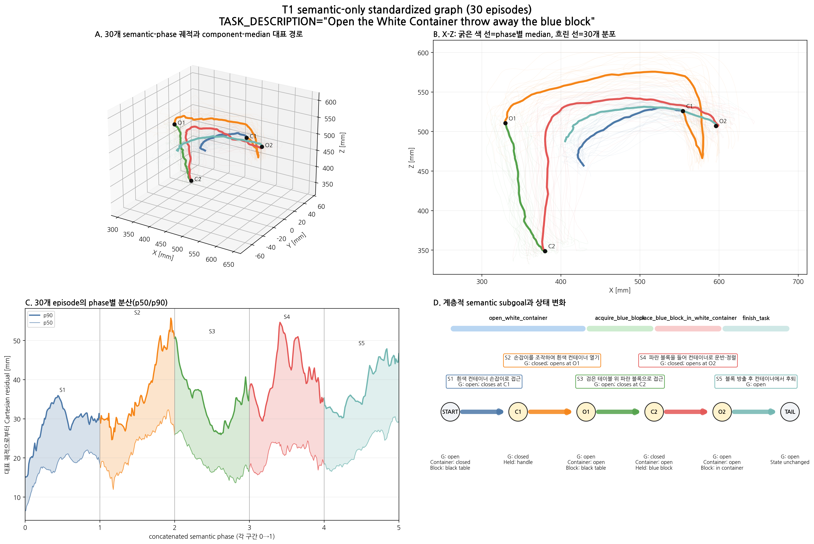
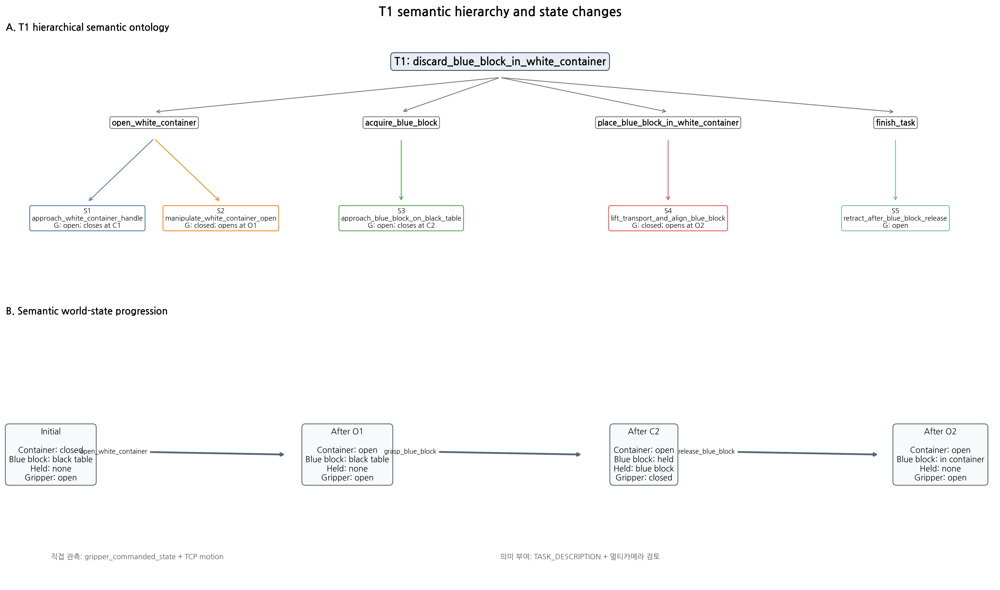

# T1 semantic-only standardized graph V3

TASK_DESCRIPTION: `Open the White Container throw away the blue block`

## 설계 범위

30개 demonstration에서 semantic 정보만 구분한다. 각 구간은 Cartesian
arc-length phase `0..1`로 표준화하고 동일 phase의 component median을 대표
궤적으로 사용한다. 특정 실제 episode를 대표로 선택하지 않는다.





## 계층적 semantic segment

| ID | 상위 subgoal | Semantic label | Gripper 의미 | 대상 | 대표 경로 길이 [mm] | phase 평균 p90 residual [mm] | 신뢰도 |
|---|---|---|---|---|---:|---:|---|
| S1 | `open_white_container` | `approach_white_container_handle` | open; closes at C1 | white_container_handle | 197.8 | 28.9 | high |
| S2 | `open_white_container` | `manipulate_white_container_open` | closed; opens at O1 | white_container_handle | 479.2 | 36.5 | high |
| S3 | `acquire_blue_block` | `approach_blue_block_on_black_table` | open; closes at C2 | blue_block | 209.0 | 34.5 | high |
| S4 | `place_blue_block_in_white_container` | `lift_transport_and_align_blue_block` | closed; opens at O2 | blue_block | 437.2 | 41.3 | high |
| S5 | `finish_task` | `retract_after_blue_block_release` | open | none | 252.2 | 38.1 | medium |

## Semantic event grammar

`C1 → O1 → C2 → O2`

- C1: 흰색 컨테이너 손잡이 파지
- O1: 컨테이너를 연 뒤 손잡이 해제
- C2: 검은 테이블의 파란 블록 파지
- O2: 흰색 컨테이너 안에 파란 블록 방출

이 event는 semantic anchor이며 정책 전환 지점을 의미하지 않는다.

## Semantic world state

```text
Container closed, blue block on black table, gripper open
  → Container open, blue block on black table, gripper open
  → Container open, blue block held, gripper closed
  → Container open, blue block in container, gripper open
```

## 대표 정보의 정의

- 굵은 색 경로: 30개 궤적의 동일 semantic phase에서 계산한 component median
- 흐린 색 경로: 대표 선택에 사용하지 않는 30개 개별 분포
- 영상·이미지·frame 번호의 평균 또는 실제 대표 episode 선택 없음

## 포함하지 않은 판단

- 전환 적합도와 전환 phase
- Bridge 비용과 구형 경계
- 상위 planner의 task 조합 결정

## 산출물

- `semantic_graph_v3.json`: 계층, event, world-state, 대표 통계
- `semantic_segment_catalog.csv`: aggregate semantic segment
- `semantic_event_catalog.csv`: 의미 anchor
- `representative_semantic_phase.csv`: phase별 median/mean XYZ와 residual
- `standardized_semantic_phase_trajectories.npz`: 30개 표준화 궤적과 covariance
