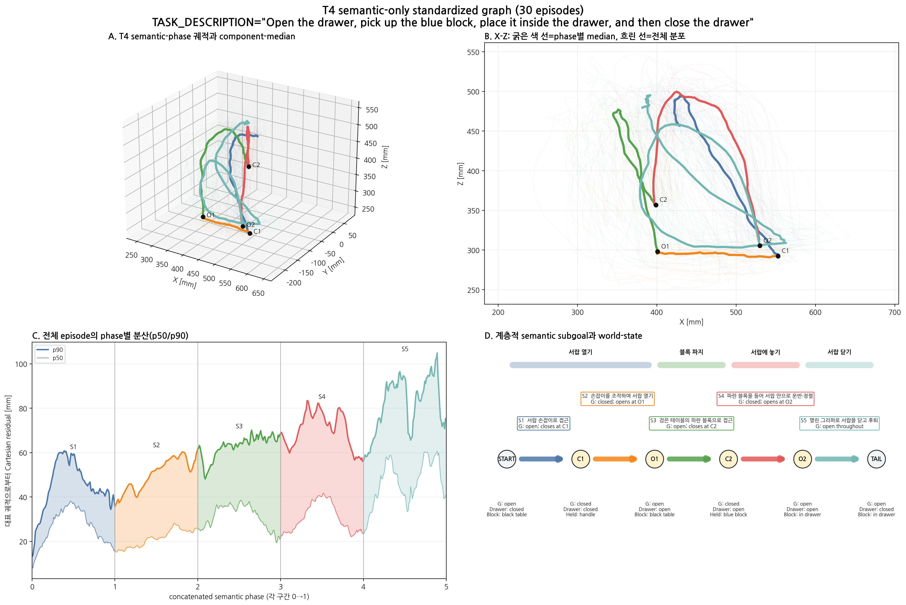
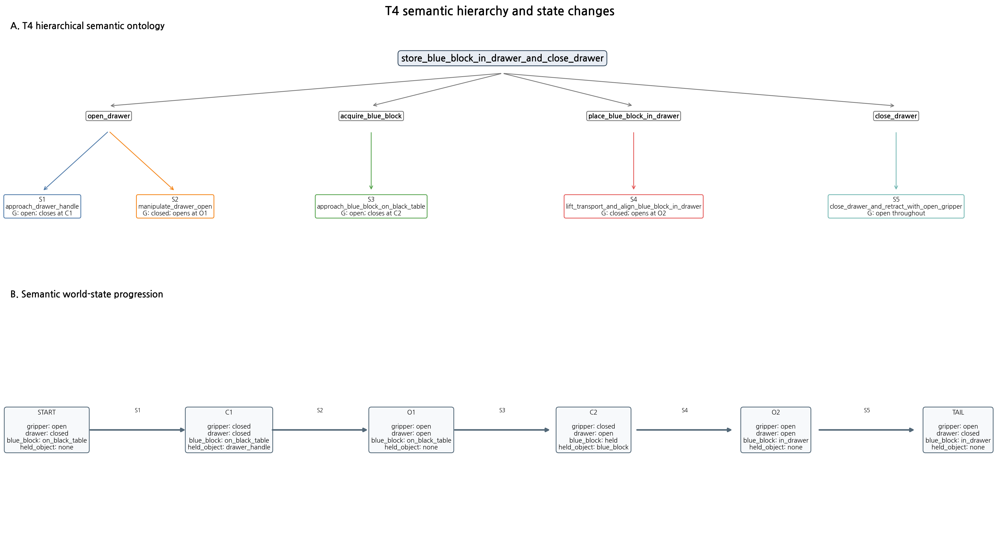

# T4 semantic-only standardized graph V3

TASK_DESCRIPTION: `Open the drawer, pick up the blue block, place it inside the drawer, and then close the drawer`  
Dataset: `/home/rvlab/lerobot_datasets/a0509_blue_block_t4`  
Associated model: `/home/rvlab/lerobot_models/models/act_a0509_blue_block_t4_bs32_80k_20260823/080000/pretrained_model`

## 설계 범위

30개 demonstration을 semantic event로 정렬하고 각 구간을 Cartesian
arc-length phase `0..1`로 표준화했다. 특정 episode를 대표로 선택하지 않으며,
frame 번호 평균·구형 runtime 경계·전환 적합도·Bridge 계산을 포함하지 않는다.





## 계층적 semantic segment

| ID | 상위 subgoal | Semantic label | Gripper 의미 | 대상 | 대표 경로 길이 [mm] | phase 평균 p90 residual [mm] | 신뢰도 |
|---|---|---|---|---|---:|---:|---|
| S1 | `open_drawer` | `approach_drawer_handle` | open; closes at C1 | drawer_handle | 430.7 | 44.8 | high |
| S2 | `open_drawer` | `manipulate_drawer_open` | closed; opens at O1 | drawer_handle | 182.2 | 50.2 | high |
| S3 | `acquire_blue_block` | `approach_blue_block_on_black_table` | open; closes at C2 | blue_block | 469.7 | 63.0 | high |
| S4 | `place_blue_block_in_drawer` | `lift_transport_and_align_blue_block_in_drawer` | closed; opens at O2 | blue_block | 507.0 | 70.3 | high |
| S5 | `close_drawer` | `close_drawer_and_retract_with_open_gripper` | open throughout | drawer_front | 1115.7 | 81.8 | medium |

## Semantic event grammar

`C1 → O1 → C2 → O2`

- C1: 서랍 손잡이 파지
- O1: 서랍을 연 뒤 손잡이 해제
- C2: 검은 테이블의 파란 블록 파지
- O2: 서랍 안에 파란 블록 방출

각 event는 semantic anchor이며 정책 전환 지점을 의미하지 않는다.

## Semantic world state

```text
gripper=open, drawer=closed, blue_block=on_black_table, held_object=none
  → gripper=closed, drawer=closed, blue_block=on_black_table, held_object=drawer_handle
  → gripper=open, drawer=open, blue_block=on_black_table, held_object=none
  → gripper=closed, drawer=open, blue_block=held, held_object=blue_block
  → gripper=open, drawer=open, blue_block=in_drawer, held_object=none
  → gripper=open, drawer=closed, blue_block=in_drawer, held_object=none
```

## Task별 주의사항

- Drawer closing occurs after O2 while the gripper remains open, so S5 is not anchored by another C/O event.
- S5 is kept as one semantic tail; no internal close-drawer boundary is invented.

## 대표 정보의 정의

- 굵은 색 경로: 전체 궤적의 동일 semantic phase에서 계산한 component median
- 흐린 색 경로: 개별 episode 분포
- 실제 대표 episode, 영상·이미지·frame 번호 평균 없음

## 포함하지 않은 판단

- 전환 적합도와 전환 phase
- Bridge 비용과 구형 경계
- 상위 planner의 task 조합 결정
