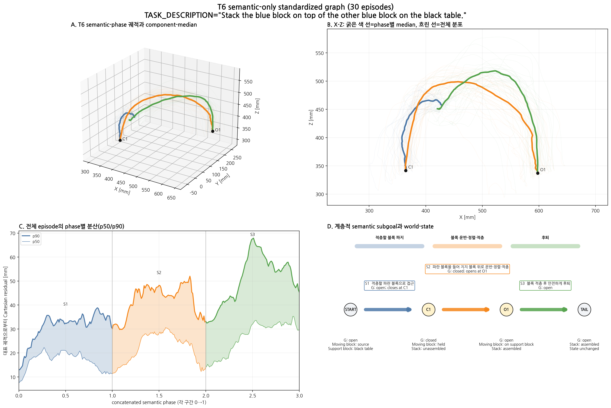
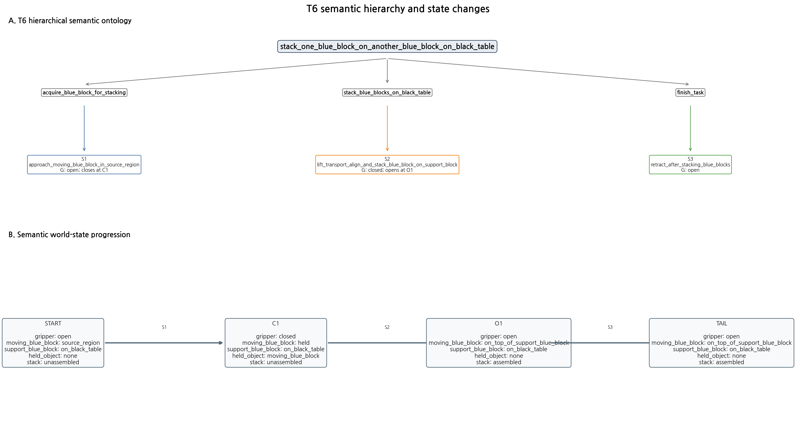

# T6 semantic-only standardized graph V3

TASK_DESCRIPTION: `Stack the blue block on top of the other blue block on the black table.`  
Dataset: `/home/rvlab/lerobot_datasets/a0509_blue_block_t6`  
Associated model: `/home/rvlab/lerobot_models/models/act_a0509_blue_block_t6_bs32_50k_20260824/050000/pretrained_model`

## 설계 범위

30개 demonstration을 semantic event로 정렬하고 각 구간을 Cartesian
arc-length phase `0..1`로 표준화했다. 특정 episode를 대표로 선택하지 않으며,
frame 번호 평균·구형 runtime 경계·전환 적합도·Bridge 계산을 포함하지 않는다.





## 계층적 semantic segment

| ID | 상위 subgoal | Semantic label | Gripper 의미 | 대상 | 대표 경로 길이 [mm] | phase 평균 p90 residual [mm] | 신뢰도 |
|---|---|---|---|---|---:|---:|---|
| S1 | `acquire_blue_block_for_stacking` | `approach_moving_blue_block_in_source_region` | open; closes at C1 | moving_blue_block | 227.5 | 30.9 | high |
| S2 | `stack_blue_blocks_on_black_table` | `lift_transport_align_and_stack_blue_block_on_support_block` | closed; opens at O1 | moving_blue_block | 576.3 | 41.9 | high |
| S3 | `finish_task` | `retract_after_stacking_blue_blocks` | open | none | 518.4 | 50.7 | medium |

## Semantic event grammar

`C1 → O1`

- C1: 적층할 파란 블록 파지
- O1: 지지 파란 블록 위에 이동 블록 방출

각 event는 semantic anchor이며 정책 전환 지점을 의미하지 않는다.

## Semantic world state

```text
gripper=open, moving_blue_block=source_region, support_blue_block=on_black_table, held_object=none, stack=unassembled
  → gripper=closed, moving_blue_block=held, support_blue_block=on_black_table, held_object=moving_blue_block, stack=unassembled
  → gripper=open, moving_blue_block=on_top_of_support_blue_block, support_blue_block=on_black_table, held_object=none, stack=assembled
  → gripper=open, moving_blue_block=on_top_of_support_blue_block, support_blue_block=on_black_table, held_object=none, stack=assembled
```

## Task별 주의사항

- All 30 episodes share the audited C1-O1 gripper-event grammar.
- TASK_DESCRIPTION identifies the stationary support block as the other blue block on the black table and disambiguates O1 as the stacking release.
- The moving block's source surface is not stated, so source_region is intentionally geometry-neutral.
- S2 remains one transport-align-stack semantic span; no unobserved contact boundary before O1 is invented.
- Semantic object roles come from TASK_DESCRIPTION, event order, and Cartesian motion; no image/frame averaging is used.

## 대표 정보의 정의

- 굵은 색 경로: 전체 궤적의 동일 semantic phase에서 계산한 component median
- 흐린 색 경로: 개별 episode 분포
- 실제 대표 episode, 영상·이미지·frame 번호 평균 없음

## 포함하지 않은 판단

- 전환 적합도와 전환 phase
- Bridge 비용과 구형 경계
- 상위 planner의 task 조합 결정
