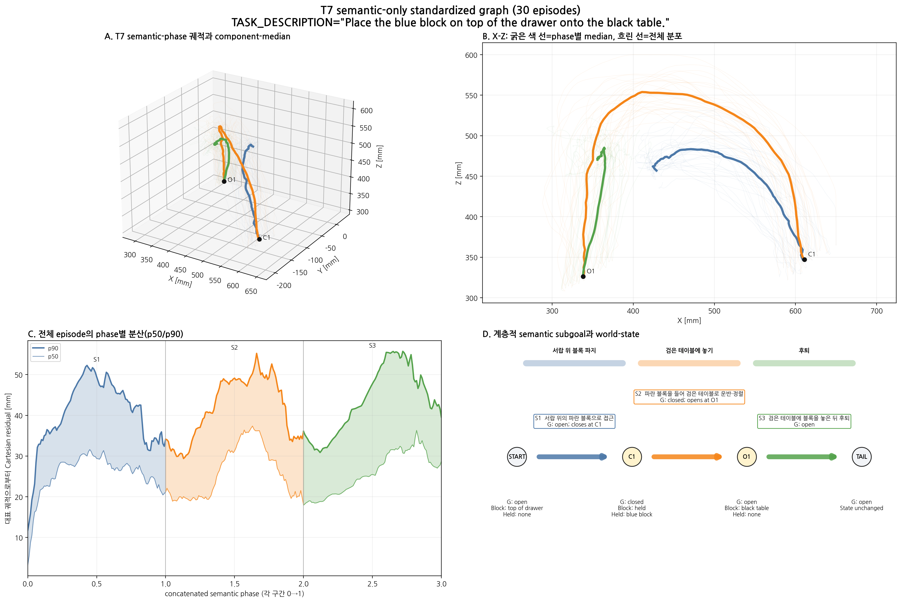
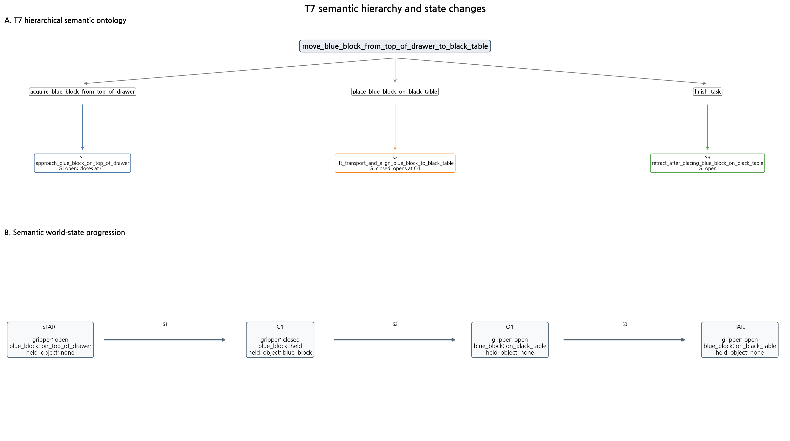

# T7 semantic-only standardized graph V3

TASK_DESCRIPTION: `Place the blue block on top of the drawer onto the black table.`  
Dataset: `/home/rvlab/lerobot_datasets/a0509_blue_block_t7`  
Associated model: `/home/rvlab/lerobot_models/models/act_a0509_blue_block_t7_bs32_40k_20260828/040000/pretrained_model`

## 설계 범위

30개 demonstration을 semantic event로 정렬하고 각 구간을 Cartesian
arc-length phase `0..1`로 표준화했다. 특정 episode를 대표로 선택하지 않으며,
frame 번호 평균·구형 runtime 경계·전환 적합도·Bridge 계산을 포함하지 않는다.





## 계층적 semantic segment

| ID | 상위 subgoal | Semantic label | Gripper 의미 | 대상 | 대표 경로 길이 [mm] | phase 평균 p90 residual [mm] | 신뢰도 |
|---|---|---|---|---|---:|---:|---|
| S1 | `acquire_blue_block_from_top_of_drawer` | `approach_blue_block_on_top_of_drawer` | open; closes at C1 | blue_block | 409.6 | 40.3 | high |
| S2 | `place_blue_block_on_black_table` | `lift_transport_and_align_blue_block_to_black_table` | closed; opens at O1 | blue_block | 663.1 | 41.8 | high |
| S3 | `finish_task` | `retract_after_placing_blue_block_on_black_table` | open | none | 269.2 | 43.6 | medium |

## Semantic event grammar

`C1 → O1`

- C1: 서랍 위의 파란 블록 파지
- O1: 검은 테이블 위에 파란 블록 방출

각 event는 semantic anchor이며 정책 전환 지점을 의미하지 않는다.

## Semantic world state

```text
gripper=open, blue_block=on_top_of_drawer, held_object=none
  → gripper=closed, blue_block=held, held_object=blue_block
  → gripper=open, blue_block=on_black_table, held_object=none
  → gripper=open, blue_block=on_black_table, held_object=none
```

## Task별 주의사항

- All 30 episodes share the audited C1-O1 gripper-event grammar.
- TASK_DESCRIPTION identifies the source as the top of the drawer and the destination as the black table.
- S2 remains one lift-transport-align-place semantic span; no unobserved contact boundary before O1 is invented.
- Semantic object roles come from TASK_DESCRIPTION, event order, and Cartesian motion; no image/frame averaging is used.

## 대표 정보의 정의

- 굵은 색 경로: 전체 궤적의 동일 semantic phase에서 계산한 component median
- 흐린 색 경로: 개별 episode 분포
- 실제 대표 episode, 영상·이미지·frame 번호 평균 없음

## 포함하지 않은 판단

- 전환 적합도와 전환 phase
- Bridge 비용과 구형 경계
- 상위 planner의 task 조합 결정
