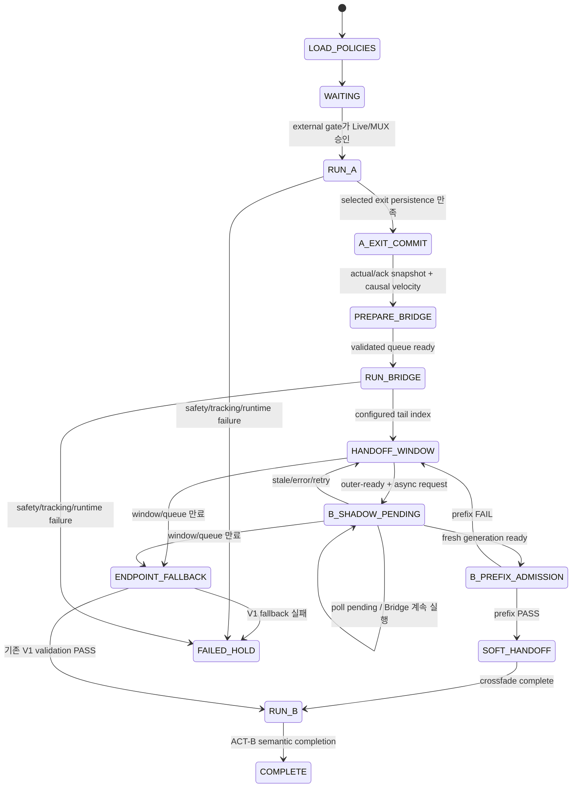
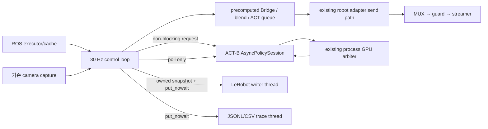

# Task-C Async Handoff V2 구현 및 검증 보고서

- 프로젝트: `Dosan-MetaQuest-teleoperation-project`
- 작성일: 2026-08-25
- 범위: 기존 Task-C V0/V1을 보존한 opt-in V2 구현
- 실기 실행 여부: 실행하지 않음
- Git 상태 확인 여부: 확인하지 않음

## 1. 결론

기존 Task-C endpoint 기반 V0/V1 경로는 유지하고, 별도 strategy인
`task_c_live_v2`와 `handoff_mode=async_window_v2`를 추가했다.

V2의 핵심 동작은 다음과 같다.

```text
episode-level handoff manifest
        ↓
Frozen ACT-A
        ↓
selected source exit commit
        ↓
latest actual/acknowledged state snapshot
        ↓
one-shot fixed cubic Bezier queue generation
        ↓
Bridge queue 30 Hz execution
        ↓
handoff window
        ├─ ACT-B asynchronous shadow request
        ├─ generation/staleness validation
        ├─ B prefix dynamic admission
        └─ Bridge queue는 계속 소비
                 ↓ PASS
        quintic + quaternion SLERP soft handoff
                 ↓
              ACT-B
                 ↓
       existing ACT rolling refresh
```

ACT-B worker 지연, stale result, generation mismatch, prefix incompatibility,
worker exception, window 만료 시 B로 강제 전환하지 않는다. Bridge command를
가능한 끝까지 계속 소비한 뒤 기존 V1 endpoint fallback을 요청하며, fallback도
실패하면 기존 fail-closed 경로를 통해 hold, Live OFF, MUX DISABLED로 갈 수
있다.

이 구현은 실제 로봇 성공, 물체 유지, 충돌 안전, IK 가능성을 증명하지 않는다.
V2 manifest는 이를 명시하기 위해 초기 버전에서 항상
`robot_executable=false`, `dry_run_only=true`,
`ik_checked=false`, `collision_checked=false`를 기록한다.

## 2. 구현 전 코드 기준 분석

문서보다 현재 소스 코드를 우선하여 다음 구조를 확인했다.

### 2.1 기존 Task-C state machine

기존 `TaskCLiveStrategy`의 공개 실행 phase는 대략 다음 흐름이다.

```text
WAITING_FOR_LIVE
→ ACT_A
→ BRIDGE
→ ACT_B
→ COMPLETE

any failure
→ FAILED_HOLD
```

V1 coordinator 내부에는 representative boundary prearm/commit, 실제 TCP
history, cubic Bezier 계획, endpoint settle, fresh ACT-B 준비, direct 또는
alignment handoff 검증이 별도로 존재한다.

### 2.2 ACT-A/B inference thread

- ACT-A는 LeRobot rollout의 기존 RTC/FIFO inference engine을 사용한다.
- ACT-B는 기존 `AsyncPolicySession`을 사용한다.
- 두 정책의 CUDA inference는 기존 process-wide GPU arbiter 계약을 공유한다.
- Bridge 구간에는 ACT-A 추가 generation을 중지하므로 ACT-B가 동일 arbiter를
  통해 준비될 수 있다.
- V2는 동시 CUDA inference를 새로 허용하지 않는다.

### 2.3 ACT queue 및 generation isolation

- 각 async request에는 generation이 부여된다.
- active/inflight generation과 다른 결과는 실행하지 않는다.
- observation timestamp와 completion timestamp가 보존된다.
- stale ACT-B 결과는 activation 전에 폐기한다.
- A exit commit 시 ACT-A queue를 pause/reset한다.
- fallback 또는 failure 시 B session도 invalidate한다.

### 2.4 기존 15-step overlap

- ACT chunk rolling refresh overlap은
  `act_async_rollout.py`의 기존 queue/blend 흐름에 있다.
- 기존 Task-C ACT-B 시작 overlap은
  `task_c_live_rollout.py`의 `_blend_b_action_overlap` 흐름에 있다.
- V2 Bridge→B soft handoff는 같은 quaternion interpolation 계약을 재사용하는
  별도 helper로 분리했으며 기본값은 15 steps다.

### 2.5 기존 Bridge 생성과 소비

V0/V1은 offline candidate/manifest와 runtime coordinator를 조합하고,
runtime에서는 actual/acknowledged state를 확인하며 Bridge target을 기존
send path로 보낸다. V2는 episode manifest에서 boundary를 고정한 뒤 A exit
commit에서만 실제 state 기반 Bridge를 instantiate하고 전체 30 Hz action
queue를 만든다.

V2 runtime에서는 corridor candidate search, clustering, duration search를
수행하지 않는다.

### 2.6 `/vr/commanded_posx` acknowledgement

정책 target은 직접 Doosan으로 가지 않는다.

```text
policy/Bridge proposal
→ /control/lerobot/target_posx
→ MUX
→ /vr/target_posx
→ safety guard
→ /vr/safe_posx
→ ServoL streamer
→ /vr/commanded_posx
→ Doosan
```

기존 robot adapter cache가 `commanded_posx` 값, freshness, receive count를
관리한다. V2도 `_submit_live_command`와 `_commit_live_command`를 그대로
통과하므로 다음 target으로 진행하기 전에 기존 acknowledgement/tracking
검사를 거친다.

### 2.7 actual TCP tracking

- `actual_tcp_position`과 robot state를 기존 adapter가 수집한다.
- recent actual TCP history에서 causal velocity를 계산한다.
- A exit에서 actual pose와 최신 acknowledged pose의 위치/회전 오차를 검사한다.
- nominal source pose를 Bridge 시작점으로 사용하지 않는다.
- Bridge 시작 위치는 최신 acknowledged command, 시작 미분은 causal actual
  velocity다.

### 2.8 MUX / Live / fail-closed

- strategy와 launcher는 LEROBOT source를 선택하지 않는다.
- strategy와 launcher는 Live ON을 호출하지 않는다.
- external trial gate가 authority를 소유한다.
- launcher는 시작과 종료에 Live OFF와 MUX DISABLED만 요청한다.
- exception은 기존 `TaskCLiveStrategy._fail()`로 전달되며 V2 generation과
  queues도 invalidate한다.

### 2.9 recording action contract

기존 A0509 LeRobot dataset 계약은 다음과 같다.

```text
observation.state: 13D
  6 joint rad
  6 TCP pose mm/deg
  1 gripper commanded state

observation.images.front:   480 x 640 x 3
observation.images.side:    480 x 640 x 3
observation.images.zed_rgb: 376 x 672 x 3

action: 7D
  XYZ + O1/O2/O3 + gripper target
```

V2는 이 exact feature names, order, shape를 검증한 뒤에만 Task-C recorder를
활성화한다.

## 3. V1과 V2 비교

| 항목 | 기존 endpoint V1 | 신규 async-window V2 |
|---|---|---|
| 선택 단위 | 대표 boundary/endpoint 중심 | hard-filtered diverse episode manifest |
| 다양성 | 대표 후보 중심 | valid set에서 normalized farthest-point sampling |
| source 시작 | V1 actual tracking 사용 | selected exit + latest actual/ack snapshot |
| Bridge | endpoint 전이 중심 | fixed cubic Bezier, actual-state full queue |
| ACT-B 준비 | endpoint settle 경로 | Bridge handoff window에서 async shadow |
| B inference 중 command | endpoint/settle 흐름 | Bridge target이 30 Hz로 계속 진행 |
| B 검증 | V1 direct/alignment validation | outer semantic gate + inner prefix dynamics |
| 전환 | 기존 overlap/direct | quintic XYZ + quaternion SLERP crossfade |
| gripper | 기존 semantic/hysteresis | held-state discrete 유지, 연속 blend 금지 |
| 실패 | fail-closed | V1 endpoint fallback 후 fail-closed |
| 선택 방법 | 기존 manifest | episode마다 immutable handoff manifest |
| recording | 기존 rollout/event | Task-C primary action + async audit sidecar |

V2는 V1을 대체하지 않는다.

```text
handoff_mode=endpoint_v1       → 기존 경로
handoff_mode=async_window_v2   → 신규 opt-in 경로
```

## 4. V2 state machine



`B_SHADOW_PENDING`와 `B_PREFIX_ADMISSION`은 control authority 상태가 아니다.
이 상태에서도 command source는 Bridge이며, B는 shadow proposal만 만든다.

## 5. Thread 및 worker 구조



### 5.1 30 Hz control path에서 하는 일

- latest observation/state 사용
- boundary tracker update
- 이미 만들어진 Bridge/action/blend queue에서 7D target 하나 선택
- ACT-B request submit 또는 non-blocking poll
- 15-step prefix metric과 15-step crossfade의 작은 vector 연산
- 기존 robot adapter에 proposal 제출
- recording용 owned memory snapshot과 bounded queue `put_nowait`
- trace queue `put_nowait`

### 5.2 30 Hz control path에서 하지 않는 일

- GPU inference 완료 대기
- `Future.result()`
- worker `Thread.join()`
- 파일 쓰기
- dataset `add_frame/save_episode/finalize`
- offline candidate 전체 검색
- clustering
- Bridge duration search
- 추가 camera blocking snapshot
- ROS long service wait

`Thread.join()`은 control loop 종료 후 recorder/trace teardown에서만 호출된다.

### 5.3 Bridge generation의 정확한 계약

A exit commit에서 고정된 boundary와 duration으로 cubic Bezier 한 개를
vectorized 방식으로 생성/검사한다. candidate 또는 duration optimization은
없다. queue 생성 latency는 `generation_latency_ms`로 기록한다.

이 one-shot commit 구간은 아직 실제 Jetson 부하에서 p95/p99를 측정하지
않았다. 따라서 실제 33.33 ms budget 준수는 shadow trace로 확인해야 한다.
budget을 넘는다면 다음 단계에서 preallocated generator worker 또는
prevalidated template instantiation으로 이동해야 하며, threshold를 생략해서는
안 된다.

## 6. Diverse Handoff Library

경로:

```text
offline_tools/cross_task_handoff/
  build_episode_phase_index.py
  enumerate_handoff_candidates.py
  validate_handoff_candidates.py
  select_diverse_handoffs.py
  run_v2_policy_shadow.py
  schema.py
  validation_config_a0509_v2.json
```

### 6.1 phase index

각 point는 최소 다음 정보를 보존한다.

- task, segment, semantic phase
- support episode/frame
- nominal XYZ와 quaternion orientation
- offline centered velocity
- gripper state
- held object
- contact mode
- semantic state
- entry/completed precondition facts

offline centered velocity는 후보 feature일 뿐이다. live Bridge의 source
velocity는 actual TCP history에서 causal하게 다시 계산한다.

### 6.2 hard filtering

다음은 cost가 아니라 rejection이다.

- gripper mismatch
- held-object mismatch
- contact-mode mismatch
- source 또는 successor가 free transport가 아님
- successor precondition 미충족
- non-finite pose
- workspace violation
- transport floor violation
- directionless source exit
- velocity/axis velocity/acceleration/curvature/jerk violation
- downstream linear/orientation per-tick ramp violation

fixture handle/drawer/container manipulation은
`contact_manipulation_assumed`, portable block 운반은
`free_transport_assumed`, 불명확한 상태는 unknown으로 분류한다. unknown을
free transport로 승격하지 않는다.

현재 repository에는 신뢰할 수 있는 robot IK/environment collision checker가
없으므로 다음 값은 항상 명시적으로 false다.

```text
ik_checked=false
collision_checked=false
```

### 6.3 diversity selection

hard filter를 통과한 후보만 다음 normalized feature로 표현한다.

- source/successor phase
- source/successor XYZ
- source/successor velocity
- Bridge length

그 후 deterministic farthest-point sampling으로 서로 떨어진 representative
handoff를 선택한다. 이 clustering은 안전 판정이 아니다.

### 6.4 episode manifest

각 episode 시작 전에 handoff 하나를 확정한다. runtime은 manifest를 다시
cluster하거나 다른 candidate로 바꾸지 않는다.

manifest는 source/successor support, pose quaternion, semantic state,
Bridge duration, transport floor, validation provenance를 포함한다.

## 7. Runtime Bridge

A exit commit 절차는 다음과 같다.

1. selected representative exit의 prearm/commit/persistence 확인
2. ACT-A engine pause/reset 및 queue generation invalidate
3. fresh actual 13D state 확인
4. fresh `/vr/commanded_posx` acknowledgement 확인
5. actual/ack position 및 quaternion rotation tracking 오차 확인
6. actual gripper/held/contact semantic state 확인
7. recent actual TCP history에서 causal velocity 추정
8. selected successor boundary로 fixed-duration cubic Bezier instantiate
9. workspace/dynamics/floor/ramp/orientation 검사
10. `round(duration × 30)`개의 7D queue 생성
11. `RUN_BRIDGE` 시작

orientation은 Doosan O1/O2/O3의 단순 Euclidean 차이가 아니라 quaternion
angle, SLERP, Doosan canonicalization을 사용한다.

gripper target은 source held semantic state로 고정한다.

## 8. ACT-B async shadow와 admission

### 8.1 outer observation-ready

handoff window에서만 다음을 검사한다.

- semantic state
- gripper state
- held object
- contact mode
- successor entry preconditions
- successor support XYZ radius
- successor support quaternion orientation radius
- crossfade에 남은 Bridge step 수

offline demonstration velocity와 정확히 같아야 한다는 hard rule은 없다.

### 8.2 async result routing

ACT-B request/result에는 다음 시간이 보존된다.

- request timestamp
- observation timestamp
- completion timestamp
- validation/preprocess/GPU/postprocess latency
- request-to-completion latency
- GPU arbiter wait latency

한 번에 하나만 in-flight다. generation mismatch와 stale result는 실행하지
않는다. 실패 후 retry는 configurable interval로 제한한다.

### 8.3 inner policy-output-ready

fresh B chunk의 첫 `prefix_steps=15`에 대해 다음을 계산한다.

- first target XYZ axis delta
- quaternion first rotation delta
- max prefix velocity
- max raw prefix acceleration (diagnostic only)
- prospective emitted-command acceleration (hard admission)
- Bridge tail과 B prefix velocity mismatch
- B prefix gripper semantic compatibility

null threshold는 조용히 무시하지 않는다. live setup에서 다음 기존 reviewed
값으로 해석한 뒤 모든 값이 resolved되었는지 검사한다.

- raw first XYZ: 기존 V1 B first-action position jump envelope
- raw first rotation: crossfade step 수 × downstream orientation ramp
- prefix velocity: 기존 V1 B predicted velocity limit
- raw prefix acceleration: trace/calibration metadata only; runtime hard reject 아님
- velocity mismatch: 기존 V1 handoff tolerance
- prospective crossfade XYZ step: downstream linear ramp per tick
- prospective crossfade rotation step: downstream orientation ramp per tick
- prospective command acceleration: command-space shadow calibration의 명시적 값

raw B prefix acceleration은 수치만 기록하고 reject하지 않는다. hard acceleration은 실제 `/vr/commanded_posx`의 최근 `cmd[k-1], cmd[k]`와 실행 예정인 quintic Bridge/B blend 및 첫 post-crossfade B action으로 command stream을 재구성해 계산한다. actual TCP는 tracking admission에서 별도로 검사하며 command acceleration 계산에는 섞지 않는다.

prospective command acceleration threshold가 명시되지 않으면 live setup 전에 fail-closed한다. Bridge feasibility의 `300 mm/s²`를 자동 재사용하지 않는다.

## 9. Soft handoff

prefix PASS 시 Bridge tail과 B head를 기본 15 steps 동안 blend한다.

```text
w(s) = 10s^3 - 15s^4 + 6s^5
```

- XYZ: `(1-w) Bridge + w B`
- orientation: quaternion SLERP + Doosan canonicalization
- gripper: 연속 blend하지 않고 held semantic target 유지
- 마지막 step: B 100%
- crossfade에 소비한 B prefix는 skip한 뒤 같은 fresh generation을 active
  ACT-B queue로 넘긴다.
- 이후 rolling refresh/queue threshold/overlap은 기존 ACT-B 경로를 사용한다.

splice selector는 향후 `best B[j]`를 넣을 수 있게 분리했지만 초기 V2는
명시적으로 `j=0`만 사용한다.

## 10. Failure와 V1 fallback

다음은 B takeover를 일으키지 않는다.

- inference timeout/stale
- worker exception
- generation mismatch
- semantic/gripper/held/contact mismatch
- first target jump
- velocity/acceleration mismatch
- tracking error
- handoff window 만료

window 안에서는 Bridge가 계속 실행된다. window가 끝나면 V2 B session을
invalidate하고 기존 V1 endpoint-stop/fresh-B coordinator를 재사용한다.

V1 fallback용 ACT-B checkpoint와 V2 ACT-B checkpoint가 다르면 setup을
거부한다. fallback이 비활성화되어 있거나 fallback validation이 실패하면
`FAILED_HOLD`로 간다.

## 11. Task-C demonstration recording

`RECORD_TASK_C_DATASET=true`일 때만 활성화된다.

primary action은 source dataset과 동일한 7D proposal contract다.

| 구간 | 기록 action |
|---|---|
| ACT-A | ACT-A proposal |
| Bridge | 실제 Bridge proposal |
| soft handoff | 실제 blended proposal |
| ACT-B | ACT-B proposal |

파일 쓰기와 LeRobot `add_frame/save_episode/finalize`는 background writer가
담당한다. control thread는 owned snapshot과 `put_nowait`만 수행한다.
queue가 가득 차면 frame을 버리지 않고 `RecordingBackpressureError`로
fail-closed한다.

별도 JSONL/CSV trace에는 다음을 기록한다.

- handoff id, source/successor phase
- selected policy proposal
- safe pose, commanded pose, actual TCP
- teacher/control stage
- Bridge index/progress
- handoff-window progress
- crossfade weight
- B generation과 timing
- compatibility metrics
- control tick p50/p95/p99/max와 deadline misses
- terminal state, fallback, failure reasons

완료된 episode만 save하며 실패 episode는 pending buffer를 clear한다.

## 12. 설정

참조 설정은 `config/realtime/task_c_handoff_v2.yaml`에 있다. 이 YAML은
현재 LeRobot parser가 자동으로 읽는 파일이 아니라 계약 문서이며, launcher가
동일 값을 CLI로 전달한다.

기본값:

```yaml
handoff_window_steps: 24
b_prefix_steps: 15
crossfade_steps: 15
max_b_result_age_sec: 0.30
max_inflight_b_requests: 1
b_request_retry_interval_steps: 3
enable_soft_handoff: true
enable_endpoint_fallback: true
record_task_c_dataset: false
recording_queue_size: 96
```

24 steps는 30 Hz에서 약 0.8초, 15 steps는 약 0.5초다. 이는 확정된 물리
최적값이 아니라 shadow latency 결과로 조정할 parameter다.

## 13. 코드 변경 목록

### 신규 runtime integration

```text
src/lerobot_robot_doosan_a0509/lerobot_robot_doosan_a0509/
  task_c_live_v2_rollout.py
  task_c_live_v2_entrypoint.py
  task_c_handoff/
    __init__.py
    models.py
    bridge_runtime.py
    async_successor.py
    compatibility.py
    coordinator.py
    soft_handoff.py
    handoff_trace.py
    recording.py
```

### 신규 offline 및 launcher/config

```text
offline_tools/cross_task_handoff/
  __init__.py
  schema.py
  build_episode_phase_index.py
  enumerate_handoff_candidates.py
  validate_handoff_candidates.py
  select_diverse_handoffs.py
  run_v2_policy_shadow.py
  validation_config_a0509_v2.json

scripts/run_task_c_async_handoff_v2_candidate.sh
config/realtime/task_c_handoff_v2.yaml
```

### 신규 테스트

```text
src/lerobot_robot_doosan_a0509/test/
  test_task_c_handoff_v2.py
  test_cross_task_handoff_v2.py
  test_task_c_handoff_v2_io.py
  test_task_c_handoff_v2_failure_routing.py
```

### 갱신 문서

```text
offline_tools/cross_task_handoff/README.md
docs/task_c_async_handoff_v2_implementation_2026-08-25.md
```

기존 `task_c_live_rollout.py`, V0/V1 offline implementation, MUX, safety
guard, ServoL streamer의 기본 경로는 V2 로직으로 교체하지 않았다. V2는 별도
subclass와 별도 entrypoint에서 opt-in된다.

## 14. 테스트 결과

### 14.1 LeRobot runtime/offline/recording 전체

```bash
pytest -q src/lerobot_robot_doosan_a0509/test
```

결과:

```text
152 passed in 13.57s
```

여기에는 다음 V2 항목이 포함된다.

- quintic C2 boundary derivative
- Bridge queue length와 handoff window index
- prefix velocity/acceleration
- prospective blended command와 post-crossfade 첫 action의 per-tick admission
- quaternion SLERP와 discrete gripper
- B latency 50/100/200/500 ms에서 Bridge tick non-blocking
- window timeout fallback
- worker exception 중 command gap 방지
- stale/generation mismatch rejection
- offline candidate round-trip
- deterministic diverse selection
- fixture/unknown contact hard rejection
- successor precondition hard rejection
- floor/direction hard rejection
- orientation support gate
- async LeRobot writer
- writer failure no-close-deadlock
- JSONL/CSV serialization
- tick percentile/deadline summary
- launcher가 Live ON/LEROBOT select를 하지 않는 정적 계약

### 14.2 MUX/safety/streamer 회귀

```bash
pytest -q src/quest_a0509_teleop/test
```

결과:

```text
93 passed in 0.39s
```

총 245 tests가 통과했다.

### 14.3 compile, shell, build, install import

```text
Python compileall: PASS
launcher bash -n: PASS
colcon build --packages-select lerobot_robot_doosan_a0509 --symlink-install:
  1 package finished
installed strategy/coordinator import:
  TASK_C_V2_INSTALL_IMPORT_OK
```

### 14.4 실제 dataset command-free smoke

phase index 생성 결과:

| task | points |
|---|---:|
| T1 | 1650 |
| T2 | 1023 |
| T3 | 990 |
| T5 | 1650 |
| T6 | 990 |

fixture manipulation, free transport, free motion, unknown contact 구분도
산출물에 보존됨을 확인했다.

임의 T2→T3 조합 500개를 현재 보수적 설정으로 검사한 결과 feasible 후보는
0개였다.

주요 rejection:

```text
curvature_limit:      500
acceleration_limit:    66
axis_velocity_limit:   45
linear_ramp_limit:     45
```

이는 filter를 우회해야 한다는 뜻이 아니다. 실제 사용할 source/successor
semantic segment와 Bridge duration을 다시 지정하여 offline enumeration을
수행하고, feasible set이 생기지 않으면 shadow trace를 근거로 기존 constraint
또는 boundary 정의를 검토해야 한다. 현재 확인되지 않은 candidate를 물리
실행용으로 간주해서는 안 된다.

## 15. 현재 미검증 항목

다음은 테스트 통과 사실로 표현할 수 없다.

- 실제 robot Task-C 성공률
- Jetson 실제 부하에서 control tick p95/p99/max
- 실제 ACT-B preparation p50/p95/p99
- commit-time Bridge generation p95/p99
- physical acceleration/jerk 감소
- gripper가 물체를 계속 유지하는지
- drawer/container/contact interaction
- IK feasibility
- environment/self collision safety
- camera USB contention 하의 30 Hz 유지
- 30 episode 자동 recording의 장시간 안정성
- diverse handoff가 실제 RGB/state/action diversity를 얼마나 만드는지

## 16. 단계별 수동 검증 절차

아래 명령은 절차 문서이며 이번 구현 작업에서는 실행하지 않았다.

### 16.1 공통 환경

```bash
cd ~/Dosan-MetaQuest-teleoperation-project
source /opt/ros/jazzy/setup.bash
source ~/venvs/lerobot/bin/activate
source install/setup.bash
export PYTHONPATH="$PWD/src/quest_a0509_teleop:$PWD/src/lerobot_robot_doosan_a0509:$PWD:${PYTHONPATH:-}"
```

### 16.2 기존 dual-ACT command-free dry-run

```bash
python -m offline_tools.task_c_bridge_v0.run_dual_act_dry_run \
  --checkpoint-a "$CHECKPOINT_A" \
  --checkpoint-b "$CHECKPOINT_B" \
  --dataset-a "$DATASET_A" \
  --dataset-b "$DATASET_B" \
  --a-episode "$A_EPISODE" \
  --a-frame "$A_FRAME" \
  --b-episode "$B_EPISODE" \
  --b-frame "$B_FRAME" \
  --device cuda \
  --action-hz 30 \
  --warmup-inferences 2 \
  --timeout-s 30 \
  --velocity-window-steps 5 \
  --output "$WORK_DIR/dual_act_dry_run.json"
```

### 16.3 신규 V2 command-free policy shadow

```bash
python -m offline_tools.cross_task_handoff.run_v2_policy_shadow \
  --episode-manifest "$HANDOFF_EPISODE_MANIFEST" \
  --checkpoint-b "$CHECKPOINT_B" \
  --dataset-b "$DATASET_B" \
  --validation-config offline_tools/cross_task_handoff/validation_config_a0509_v2.json \
  --handoff-window-steps 24 \
  --prefix-steps 15 \
  --crossfade-steps 15 \
  --max-result-age-s 0.30 \
  --max-crossfade-command-acceleration-mm-s2 4000 \
  --output "$WORK_DIR/v2_policy_shadow.json"
```

확인 항목:

```text
robot_commands_published == 0
fresh generation
stale == false
prefix admission result
Bridge tick duration during artificial/actual B latency
crossfade output continuity
```

### 16.4 ROS graph preflight-only

Terminal 1에서 V2 strategy를 Live OFF/MUX DISABLED 상태로 띄운다.

```bash
export CHECKPOINT_A="/absolute/path/to/A/pretrained_model"
export CHECKPOINT_B="/absolute/path/to/B/pretrained_model"
export RUNTIME_MANIFEST="/absolute/path/to/reviewed_v1_runtime_manifest.json"
export HANDOFF_EPISODE_MANIFEST="/absolute/path/to/v2_episode_manifest.json"
export RECORD_TASK_C_DATASET=false
export MAX_CROSSFADE_COMMAND_ACCELERATION_MM_S2=4000
export DURATION_S=180

./scripts/run_task_c_async_handoff_v2_candidate.sh
```

이 launcher 자체는 LEROBOT을 선택하거나 Live를 켜지 않는다.

Terminal 2에서 `--execute` 없이 preflight만 수행한다.

```bash
python scripts/a0509_task_c_live_trial_gate.py \
  --report-json /tmp/task_c_v2_preflight.json
```

기대 결과:

```text
TASK_C_GATE_PREFLIGHT=PASSED
TASK_C_GATE_STATE=PREFLIGHT_ONLY_COMPLETE
```

### 16.5 5-second bounded ACT-A authority 확인

V2 strategy가 WAITING 상태이고 작업 공간/준비 자세/그리퍼를 사용자가 직접
확인한 뒤, 기존 5초 gate로 ACT-A 구간만 제한 검증한다.

```bash
python scripts/a0509_act_live_trial_gate.py --duration-sec 5
```

이 단계는 Bridge 검증이 아니라 external authority, 첫 fresh target,
fail-safe cleanup을 확인하는 단계다.

### 16.6 single-Bridge 관찰

현재 full Task-C gate는 Bridge-only 자동 종료 옵션을 제공하지 않는다.
따라서 첫 물리 V2 시도에서 무인 full sequence를 바로 실행하지 않는다.

권장 절차:

1. `RECORD_TASK_C_DATASET=false`
2. handoff 하나만 담은 reviewed manifest 사용
3. operator가 V2 JSONL을 별도 terminal에서 관찰
4. source exit와 Bridge를 관찰한 직후 gate에 SIGINT/Ctrl-C
5. gate `finally`의 Live OFF/MUX DISABLED 결과 확인
6. Bridge generation latency, tick max, raw→safe→commanded trace 검토

자동 single-Bridge 종료 gate가 필요하면 별도 안전 gate 기능으로 구현한 뒤
physical test를 진행해야 한다. 일반 `timeout -9`는 cleanup을 건너뛸 수
있으므로 사용하지 않는다.

### 16.7 full Task-C

위 단계가 모두 통과하고 사용자가 물리 실행을 명시적으로 승인할 때만 두 번째
terminal에서 기존 gate의 이중 승인을 사용한다.

```bash
python scripts/a0509_task_c_live_trial_gate.py \
  --execute \
  --motion-authorization=I_ACKNOWLEDGE_TASK_C_REAL_ROBOT_MOTION \
  --transition-timeout-sec 90 \
  --report-json /tmp/task_c_v2_full_trial.json
```

gate는 다음을 계속 감시한다.

- LEROBOT MUX ownership
- Live state
- fresh raw/safe/actual/commanded topics
- Bridge raw→safe와 safe→commanded 일치
- gripper release authorization/order
- Task-C terminal completion

### 16.8 Task-C recording

shadow 및 bounded 물리 검증 후에만 Terminal 1 launcher에서 다음을 추가한다.

```bash
export RECORD_TASK_C_DATASET=true
export DATASET_REPO_ID="local/task_c_async_v2"
export DATASET_ROOT="$HOME/lerobot_datasets/task_c_async_v2_$(date +%Y%m%d_%H%M%S)"
export TASK_DESCRIPTION="Composed Task-C demonstration"
```

실패 episode는 저장하지 않으며, successful COMPLETE episode만 하나의 LeRobot
episode로 finalize한다.

## 17. 최종 불변조건 점검

- 기존 V0/V1 선택 가능: 충족
- ACT chunk 100 / action steps 100 / overlap 15 유지: 충족
- target rate 30 Hz 유지: 구조상 충족, 물리 timing은 미검증
- B inference wait 금지: 충족
- Bridge queue 계속 실행: unit/simulated timing test 통과
- candidate diversity는 offline/episode frequency: 충족
- runtime candidate search 없음: 충족
- actual/acknowledged state Bridge: 충족
- quaternion orientation: 충족
- gripper discrete held-state: 충족
- stale/generation isolation: 충족
- V1 endpoint fallback: 충족
- safety/MUX/ServoL 우회 없음: 충족
- 자동 Live ON/LEROBOT select 없음: 충족
- primary LeRobot 13D/3 RGB/7D 계약: 충족
- trace와 latency summary: 충족
- 실제 IK/collision/robot success 주장 금지: 충족

가장 중요한 V2 acceptance는 다음 형태로 구현되었다.

```text
ACT-B inference pending
    ≠
Bridge command pending

ACT-B는 background에서 준비되고,
control tick은 준비된 Bridge target을 계속 전송한다.
```


## 18. T2→T3 semantic floor-to-floor command-free validation

### 18.1 composition scope

전체 T2/T3 궤적을 통째로 비교하지 않았다. semantic graph에서 다음 구간만 사용했다.

```text
T2 S1: source floor의 blue block 접근·파지
T2 S2 phase 0.3..0.5: closed + blue_block held + lift/free transport
                    ↓ Bridge candidate boundary
T3 S2 phase 0.5..0.7: closed + blue_block held + off-table transport/descent
T3 S3: destination floor에 release 후 retract
```

T2의 black-table release와 T3의 black-table re-grasp 구간은 합성 경로에서 제외했다. 따라서 목표 의미는 `한 바닥에서 파란 블록을 집어 다른 바닥으로 옮겨 놓기`다.

### 18.2 nominal candidate result

- semantic source points: 93
- semantic successor points: 90
- semantic pairs: 8,370
- direction/distance prefilter 통과: 1,798 pairs
- 10 bridge durations 평가: 17,980
- hard filter 통과: 17,452
- normalized farthest-point selection: 10 episode manifests
- cubic Bezier generator는 모든 후보에서 동일

대표 경로 그림:

- `docs/artifacts/task_c_t2_t3_floor_to_floor_v2_2026-08-25/semantic_floor_to_floor_selected_path.png`
- 동일 vector: `semantic_floor_to_floor_selected_path.svg`

대표 `h_d4ebd8858ac1`은 T2 episode 27 frame 428에서 exit하고, 5.0 s Bridge 뒤 T3 episode 8 frame 429 support로 들어간다. 그림의 teal은 T2 retained prefix, orange는 Bridge, green은 T3 retained suffix다.

### 18.3 T3 prefix calibration

T3 S2 phase 0.5..0.7의 unique support 86개에서 15-step demonstration action prefix를 측정했다. raw max acceleration norm의 p95는 `3564.648 mm/s²`였고 진단 기준값을 `3565 mm/s²`로 올림했다. 2026-08-26 수정 이후 이 값은 hard reject가 아니다.

```text
raw first XYZ envelope       75 mm       V1 B first-action jump
raw first rotation envelope  15 deg      15 ticks × 1 deg/tick
raw prefix velocity          300 mm/s    V1 B predicted velocity
raw prefix acceleration      3565 mm/s²  semantic support p95, diagnostic only
velocity mismatch            75 mm/s     V1 handoff tolerance
actual blend XYZ step        6.67 mm      streamer per-tick ramp
actual blend rotation step   1.0 deg      streamer per-tick ramp
```

보정 산출물은 `successor_prefix_dynamics_calibration.json`이다. Raw B dynamics 분포를 설명할 뿐 command acceleration limit이나 collision/payload safety 증명은 아니다.

#### 18.3.1 2026-08-26 command acceleration correction

기존 physical trace의 `5161.906 mm/s²`는 actual TCP에서 첫 prospective command로의 tracking lag를 한 tick 이동으로 계산한 값이므로 제거했다. 새 계산은 최근 두 acknowledged `/vr/commanded_posx`와 prospective command sequence만 사용한다.

```text
representative h_d4 raw B acceleration       932.758 mm/s² (diagnostic)
reconstructed command acceleration          1600.483 mm/s²
previous acknowledged-command velocity      [-12.278, -40.390, -25.872] mm/s
first prospective crossfade velocity        [-13.400, -42.457, -27.788] mm/s
control tick p99 / max                       2.065 / 3.907 ms
robot_commands_published                     0
```

이 단일 shadow 값만으로 hardware limit를 주장할 수는 없다. 현재 V2 live admission의 잠정 command-space 상한은 기존 shadow 결과(약 `1564~3334 mm/s²`)에 약 20% 여유를 둔 `4000 mm/s²`로 선택했다. launcher와 strategy의 기본값도 `4000`이며 환경변수 `MAX_CROSSFADE_COMMAND_ACCELERATION_MM_S2`로 실험별 override할 수 있다. 이 값은 30 Hz proposal-command 유한차분 임계값이지 Doosan hardware acceleration rating이 아니다.

### 18.4 actual T3 checkpoint shadow

실제 checkpoint `act_a0509_blue_block_t3_bs32_40k_20260822/040000/pretrained_model`과 각 manifest의 recorded RGB/13D support observation을 사용했다. ROS publish, Live, MUX 선택은 모두 0/false다.

| handoff | result | raw first max-axis | prospective max-axis step | max rotation step | B prepare | deadline miss |
|---|---:|---:|---:|---:|---:|---:|
| h_d4ebd8858ac1 | RUN_B | 28.07 mm | 5.032 mm | 0.235° | 112.4 ms | 0 |
| h_a446f0627826 | RUN_B | 32.24 mm | 6.153 mm | 0.172° | 59.9 ms | 0 |
| h_b173553f94bc | RUN_B | 35.35 mm | 5.675 mm | 0.242° | 97.5 ms | 0 |
| h_32ec5439db37 | FALLBACK | 46.79 mm | 7.663 mm | 0.180° | 43.5 ms | 0 |

마지막 후보는 semantic/nominal Bridge가 valid여도 prospective blend가 `7.663 > 6.67 mm/tick`이어서 ACT-B takeover를 거부하고 endpoint fallback으로 갔다. 이는 diversity selection과 실제 policy-output admission이 분리되어 작동한다는 command-free 증거다.

대표 PASS의 control tick은 p99 `2.302 ms`, max `4.530 ms`, deadline miss 0이었다. B inference 112.4 ms 동안 Bridge command queue는 중단 없이 진행됐다.

### 18.5 validation boundary

확인된 것:

- semantic floor-to-floor 경로 생성
- 실제 T3 model output을 이용한 async shadow inference
- prospective blended command admission
- PASS 3개와 안전 rejection/fallback 1개
- robot command publication 0

아직 확인되지 않은 것:

- IK와 environment/payload collision
- 실제 물체를 놓치지 않는지
- 실제 robot tracking과 물리 가속도
- bounded physical Task-C 성공

따라서 다음 단계는 자동 Live가 아니라 user-operated shadow ROS → 5-second bounded gate → single Bridge 순서다.
